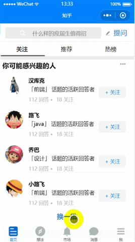
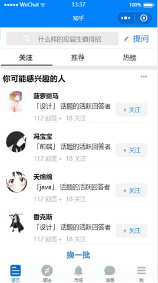
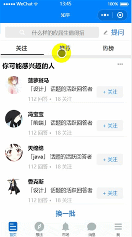

# weapp-wechat-zhihu

微信中的知乎--微信小程序 demo // Zhihu in Wechat ios version


### description
- 界面及交互设计来自知乎 ios 版本
- 借鉴了一些Rebecca_Han写的安卓版本的 本着学习态度的 https://github.com/RebeccaHanjw/weapp-wechat-zhihu.git 有兴趣的可先去看一下安卓版的，我在此基础改动新增了一些功能
- _工具_: [微信 web 开发者工具](https://mp.weixin.qq.com/debug/wxadoc/dev/devtools/download.html?t=1477579747265)
- _数据_: 没有开放 API, 所以使用伪造本地数据

#### 功能及使用的组件等
* 列表式渲染数据
* 自定义顶部 tabbar
* 下拉刷新
* 上拉加载更多
* 左右滑动切换tabbar及内容
<br/>等开发中...

### Setup

```
https://github.com/zmc1212/zhihu_ios.git
```
下载安装Wechat DEV Tools, 并导入项目

### 演示

首页换一批，关注等



顶部自定义 tab 切换



底部 tab 切换



页面跳转


##### Demo 用于学习交流, 转载请注明出处


